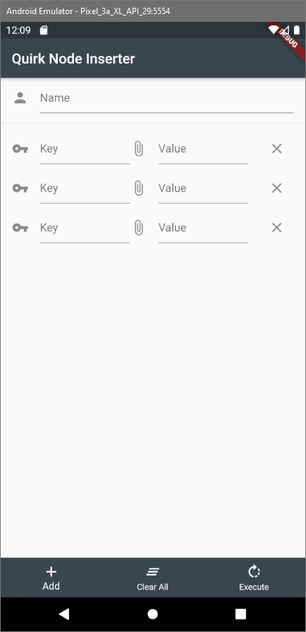
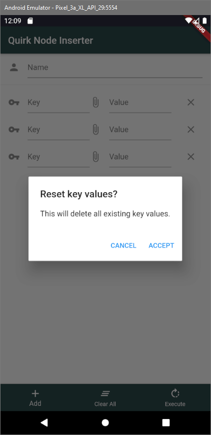
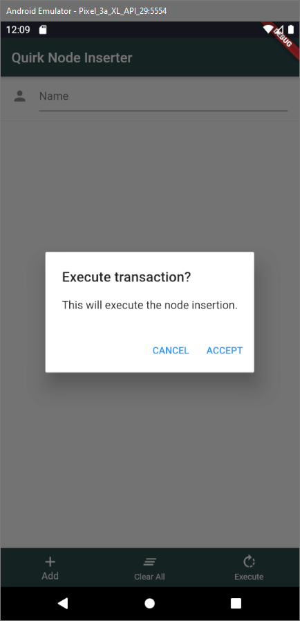

# Quirk App

Learning Flutter+Dart to make a small Android/iOS app. This is just for learning purposes.

---

The screen starts off with no key/value pairs, but by hitting the `Add` button you can create new key/value pairs. By hitting the `X` trailing at the end you may delete each key/value individually.

---

Using the clear all button will prompt you to confirm if you wish to delete all the keys and values.

---

Execute button will insert the node with the given keys and values.

